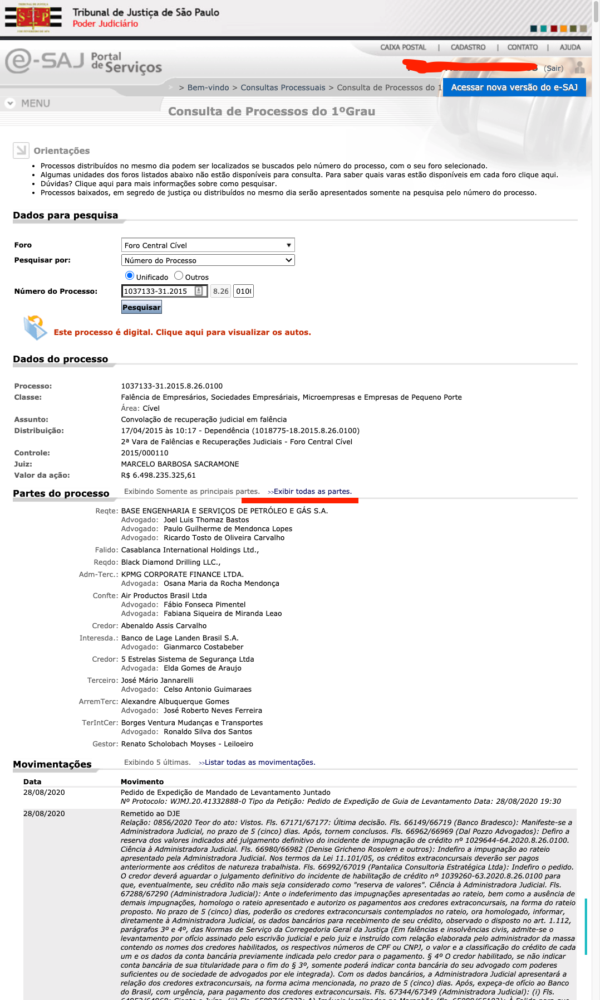
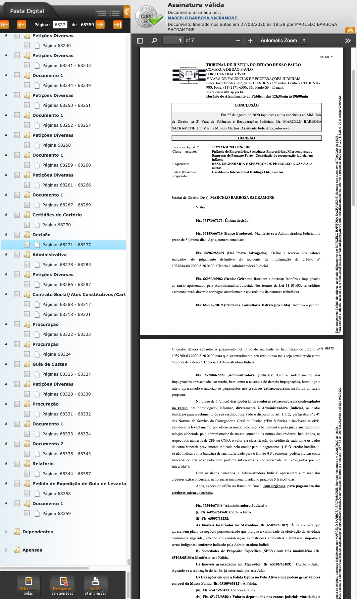

# MAC6967-G6-NLP-juridico

Members:   
- Marcelo de Souza (marcelo.mcs@ime.usp.br)
- Pedro Almeida  (pedro.hba@usp.br)
- Ricardo Tanaka (raktanaka@gmail.com)
- Thomas Ferraz (thomas.ferraz@usp.br)  
- Verena Saeta (verenacsaeta@usp.br)

Supervisor 
- Rafael Ferreira (rafaelferreira@usp.br)

## Introduction

The project has been developed during the second semester of 2020 as Vox Legis, in the course MAC0434/MAC6967 offered by IME-USP, prof. Fabio Kon, under supervision by prof. Rafael Ferreira - FEA-USP.

Development was made with Jupyter Notebooks, which are in the [``/codes``](https://gitlab.com/thomas-ferraz/MAC6967-G6-NLP-juridico/-/tree/master/codes) directory, with a README presenting further information. The Notebooks are can be run inside the Google Collaboratory platform, with data in Google Drive; or in a local machine, provided data is local.

Due to privacy concerns, the dataset is not provided, and a request to prof. Rafael Ferreira is needed to obtain it.

## Abstract

The main proposal of this project is to create an algorithm capable of extracting information from the records of a lawsuit in order to obtain knowledge and outcomes such as:
- Factors unrelated to the characteristics of the process that can affect judges' decisions:
  - Ethnic, racial and gender prejudices;
  - Judge's experience;
  - Judge's political opinions;
  - Judge' personal sports preferences;
  - Other bias.
- How to map the factors that may affect the outcome of the merit of the case and obtain a measure of impartiality from the Judiciary;
- Analysis of the existence of variance in decisions as a measure of legal uncertainty;
- Locate biases and preference that have consequences on the real world.

## Accomplished 

1. Get samples of lawsuit records;
2. Extract administrative data from these procedures;
    - [extract_rds](https://gitlab.com/thomas-ferraz/MAC6967-G6-NLP-juridico/-/blob/master/codes/extract_rds.ipynb)
    - [extract_html](https://gitlab.com/thomas-ferraz/MAC6967-G6-NLP-juridico/-/blob/master/codes/extract_html.ipynb)
3. Download the PDFs of the files of these procedures;
4. Extract strings from the PDF;
    - [extract_unzip](https://gitlab.com/thomas-ferraz/MAC6967-G6-NLP-juridico/-/blob/master/codes/extract_unzip.ipynb)
    - [extract_pdf](https://gitlab.com/thomas-ferraz/MAC6967-G6-NLP-juridico/-/blob/master/codes/extract_pdf.ipynb)
5. Identify who attached each document to the procedure file;
    - [extract_pdf](https://gitlab.com/thomas-ferraz/MAC6967-G6-NLP-juridico/-/blob/master/codes/extract_pdf.ipynb)
5. If the document was attached by a lawyer, identify which party is represented by this lawyer;
    - [extract_html](https://gitlab.com/thomas-ferraz/MAC6967-G6-NLP-juridico/-/blob/master/codes/extract_html.ipynb)
6. Identify which of the documents are judicial sentences;
    - [extract_pdf](https://gitlab.com/thomas-ferraz/MAC6967-G6-NLP-juridico/-/blob/master/codes/extract_pdf.ipynb)
7. Classify decision into positive or negative according to the applicant (who started the legal action).
    - [classify_decision](https://gitlab.com/thomas-ferraz/MAC6967-G6-NLP-juridico/-/blob/master/codes/classify_decisions.ipynb)

## Unsuccessful

- Cluster documents; 
    - [cluster_pdfs](https://gitlab.com/thomas-ferraz/MAC6967-G6-NLP-juridico/-/blob/master/codes/clusters_pdfs.ipynb)
- Use bigrams to generate labels.
    - [extract_bigrams](https://gitlab.com/thomas-ferraz/MAC6967-G6-NLP-juridico/-/blob/master/codes/extract_bigrams.py)

## Data

In this project we will work with data from lawsuits of the São Paulo Court of Justice (TJSP). All documents and various information from each proceeding that is currently being processed at the TJSP can be accessed through the court's electronic system, the [e-Saj](https://esaj.tjsp.jus.br/). 
Basic process information can be accessed by anyone, through the website [procedural consultation](https://esaj.tjsp.jus.br/cpopg/open.do), as long as you have the case number. In order to have access to [the complete file of the case](https://pt.wikipedia.org/wiki/Autos_processuais), containing all its documents, it is necessary to have attorney credentials and to authenticate on the website before accessing the procedural consultation page. 

The raw data for this project refer to bankruptcy and judicial recovery lawsuits. This data was collected using a list of all bankruptcy and judicial recovery proceedings initiated between 2008 and 2017, sent in early 2018 by the TJSP. From this list and the credentials of a lawyer collaborating on the project, an algorithm was created using [Selenium Library](https://robotframework.org/SeleniumLibrary/SeleniumLibrary.html) to access the e-Saj; perform authentication; extract the basic information of each case such as court, district, name of the judge, name of the parties, qualified lawyers, etc. (see Dataset 1); and download the PDF files of the case file (see Dataset 2).

### Dataset 1 - Proceedings Administrative Data

Each judicial process has a HTML page generated by the TJSP system, containing the main information of the process. The figure below shows an example, for the number process **1037133-31.2015.8.26.0100**.

Figure 1: A bankruptcy lawsuit page on e-Saj

For each bankruptcy or judicial recovery number sent by the TJSP, the page corresponding to that case number was scrapped on the Court's website. The collected information was saved in .rds files. These .rds files are in the dataset1 folder in Google Drive.

### Dataset 2 - The file entire content of each procedure 
The previous figure refers to a 2015 lawsuit. The legal proceedings from 2013 onwards are digital (or electronic) cases, and their pages on the TJSP website contain the link that allows access to the full file of proceedings, in PDF format:

When you click on this link, a new window opens, with all pages of the case file in PDF format.

Figure 3: Filings of a bankruptcy lawsuit in e-Saj

Note that this process alone has more than 68 thousand pages in PDF. The page that is open is a judicial decision. All of these PDFs have been downloaded and they are on a public Dropbox link.

### Inputs  
- Structured data on the process, extracted from the São Paulo State Court of Justice (TJSP) system:
  1. Name of the judge;
  2. Names of the lawyers;
  3. Names of the parties to the proceedings;
  4. (...)
  
- PDFs of the case files:
  1. Petitions;
  2. Judicial decisions;
  3. (...)
  
### Outputs
- For each document written by judger, classify it as positive or negative according to the applicant (the part that started the legal action). 

## Future Developments

The results obtained so far by the project are only the initial stage of a major objective: extracting the maximum amount of information and value from lawsuits, focusing mainly on the sentiment involved in each sentence. 

The fundamental mission is based on the detection of possible biases or influences in the Brazilian judicial system that may cause judgments in disagreement with the law and civil rights. After all, these misjudgments tend to affect mainly individuals with little knowledge about their own rights, often in a situation of social vulnerability and, consequently, with few opportunities for defense. In addition, the technical rigor of the legal language makes it hard to understand sentences clearly, also making it difficult for people outside the area of ​​law to understand what was decided without the help of an expert.

That said, we decided to focus on detecting some social problems that can also be reflected in the judicial system. That is, we want to verify if the type of decision of each of the analyzed judges is affected / altered by possible biases of behavior that are prejudiced or are in disagreement with social well-being, such as:

1. Gender bias (judge tends to change his/her decision pattern according to the gender of those involved in the process);
2. Race bias (judge tends to change his/her decision pattern according to the race of those involved in the process);
3. More rigid / malleable judges according to the type of process (behaviour analysis);
4. Changes in the decision pattern of judges over time (effect of experience on decisions).

These are just a few of the many types of analysis that can be made from legal data, which can enable the use of technologies to monitor and modernize the judicial system, making it closer to society. Therefore, the use of data science tools in this field can contribute to an increasingly fair and coherent system, expanding the sense of justice and equality in the most diverse social strata.

### Note about licensing

The project is licensed under the 3-clause BSD license, but for some clustering experiments [dbmap](https://pypi.org/project/dbmap/) is used, which has a GPL-v3 license.

#
